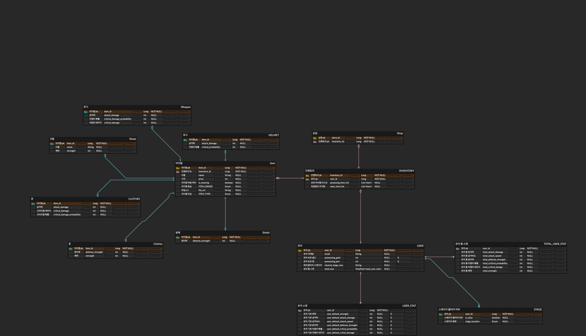

# 지구를 지켜라! 지구방위대 🔫
### 🌕 우주인들을 막는 종스크롤 액션 게임 🌎

-----------------
**1. 우주인(=우주 해적)들이 연구를 위해 지구의 여러 물체를 흡수해가고, 연구가 끝나면 쓸모가 없어져 다시 지구에 버리는 상황입니다.**

**2. 우주인을 막기 위해 지구 방위대 조직이 구성되었고, 지구 수호대원들은 우주인들이 지구로 버리는 우주 쓰레기들을 처리합니다.**

**3. 우주인들을 추적해 우주인들과 싸우고, 해치웁니다.**

**4. 우주해적선(BOSS)을 격파해, 우주 해적들을 물리치고, 각 행성을 점령해나가는 스토리입니다.**

## TEAM 지구방위대 개발팀 👨‍👨‍👧‍👦
|  |                                                   |
|-----------------------------------------------------------------------------------------------------------------|-------------------------------------------------------------|
| 강동현([@hyeon23](https://github.com/hyeon23))                                                                 | 윤병욱([@speculatingwook](https://github.com/speculatingwook)) |
| Leader / GameDev                                                                                                | PM / Back End                                               |

## 프로젝트 개요

### 제안 배경

### 프로젝트 목표

## 비즈니스 목표

## 요구사항 우선 순위 ⬆️
Client-Driven : 많이 사용되는 기술일 수록 우선순위를 높게 설정한다.

### 게임 유저

### 인벤토리

### 상점

### Back-end

| Category  | Stack                               |
| --------- |-------------------------------------|
| Framework | - Spring Boot 2.6.3                 |
| Test      | - JUnit 5                           |
| Infra     | - AWS EC2   - AWS S3 |
| Database  | - MySql           |

### Game

### Communication

| Category          | Stack     |
|-------------------|-----------|
| Communication     | KakaoTalk |
| Documents         | Notion    |

### ERD Table 임시- 사진 바꿔야함

## 개발 키워드
제네릭 와일드 카드, 쓰레드, Enum 타입, NULL, 멀티쓰레드